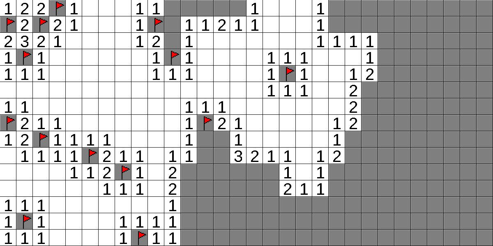
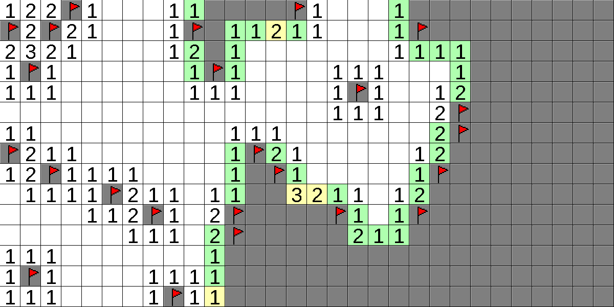
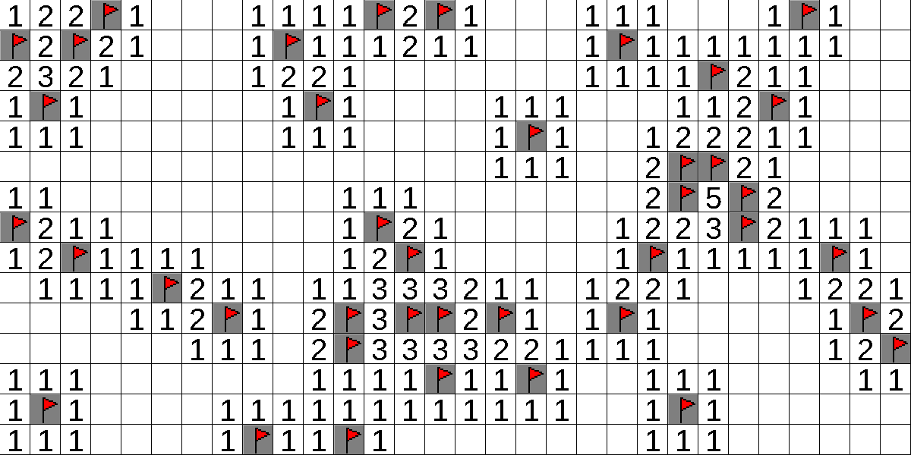

## Overview

This is a Minesweeper clone written in C++ using the SDL2 library. It includes
an auto-solving algorithm that not only provides hints for the statistically
best move, but can also automatically solve the game.

## Screenshots

  

  

  

## Features

## Usage

## Dependencies

## Limitations

## License

This work is licensed under the GNU General Public License version 3 (GPLv3).

